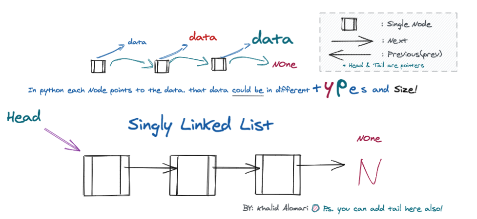

<a target="_blank" href="https://www.makeschool.com/"></a>
<br><br>
# Linked List
- what is a list “array” and what it's types?
- why do we need a _Linked one?_

@snap[south-east span-50 text-center text-06]

[Lesson Plan@fa[external-link](https://drive.google.com/file/d/1sCvCcs6VC7hmE2gKQqd1jS8jlCIHfGxP)
[Download]](https://drive.google.com/uc?id=1sCvCcs6VC7hmE2gKQqd1jS8jlCIHfGxP&export=download)

@snapend

---
@title[Add A Little Imagination]
@snap[north-west span-50 text-center]
#### Outcomes
<p align="left" style="font-size:8px"></p>
<p align="left" style="font-size:20px"> By the end of class, you will be able to:</p>
@snapend

@snap[west span-55]
@ul[list-hide-fragments text-08]
- Compare and contrast between Array (List) vs. Linked List.
- Differentiate between Static Arrays, and Dynamic Arrays.
- Understand Memory allocation.
@ulend
@snapend

@snap[east span-45]

@snapend

---
@title[Add A Little Imagination]
@snap[north-west span-50 text-center]
#### Outcomes
<p align="left" style="font-size:11px"></p>
@snapend
@snap[west span-55]
@ul[list-spaced-bullets text-08]
- Write and apply Linked List main functions.
- Explain what the Big-O benefits in some methods compared to the arrays.
- Explain the differences between Singly vs. Doubly linked List. 
@ulend
@snapend

@snap[east span-45]

@snapend

---
### Instructor Talk


---?color=linear-gradient(180deg, white 97%, #73A2DB 3%)
@snap[east span-30]
#### Arrays "List"
@snapend

@snap[north-east span-25]

@snapend

@snap[west span-78]

@snapend

---?color=linear-gradient(180deg, white 97%, #73A2DB 3%)
@snap[span-25]
#### Memory allocation
@snapend

@snap[north-west span-25]

@snapend

@snap[east span-55]

@snapend

---?color=linear-gradient(180deg, white 97%, #73A2DB 3%)
@snap[north span-30]
#### Linked List
@snapend

@snap[north-east span-25]

@snapend

@snap[west span-78]

@snapend


---
@snap[north-east span-100 text-pink text-06]
Let your code do the talking!
### Big-O
<h6 align="left"></h6>
@snapend

@snap[west text-08]
Access, Initialize, or copy: `O(n)`
<br>
Traverse/Find, Insert, or Delete :
<br>

```python zoom-18
In the beginning, middle, or the end:
O(1)    O(n)    O(n)
```
@snapend

@snap[south span-90 text-gray text-18]
@[2, zoom-18](if you have a Singly Linked List with a tail, deleting at the end will be `O(1)`.)
@[1-2](Check each method, and try to analyze it)
@snapend


---?image=assets/img/code.jpg&opacity=60&position=left&size=45% 100%
@snap[east span-50 text-center]
## Now It's **Your** Turn
@snapend

@snap[south-east span-50 text-center text-06]
LAB TIME
<a target="_blank" href="https://khalido394.github.io/Linked-List-20min_Lesson/">Worksheet & Group Challenges</a>
@snapend


---?color=linear-gradient(180deg, white 97%, #73A2DB 3%)
@snap[east span-30]
#### Linked List Types
@snapend

@snap[north-east span-25]

@snapend

@snap[west span-78]

@snapend

---?image=assets/img/code.jpg&opacity=60&position=left&size=45% 100%
@snap[east span-50 text-center]
### The End! 
###### Summary, Q&A.
@snapend

@snap[south-east span-50 text-center text-13]
Doubly linked List
<a target="_blank" href="https://khalido394.github.io/Linked-List-20min_Lesson/#singly-vs-doubly-linked-list"> Starter code </a></p>
<p align="center" style="font-size:20px"><em>Also, check the homework!</em>
@snapend

